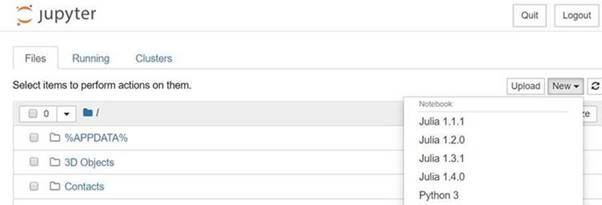

# julia-pizza-course
A collection of Jupyter notebooks to get you up to speed with Julia.

## Requirements
We will generally assume some familiarity with programming in any other language. It will
help to have some experience with the Jupyter notebook interface, but this is not required.
This short course will work on any system. Note that the following steps will take some
time, so be sure to do them well before the course.

1. Download the current stable Julia release from https://julialang.org/downloads/.
2. Start Julia and enter ] to use the built in package manager
   (https://docs.julialang.org/en/v1/stdlib/Pkg/index.html) and enter `add IJulia Plots CSV
   DataFrames`. This may take a few minutes. After, leave the package manager with a
   backspace, to enter the Julia prompt again.
3. Start a Jupyter notebook session, by typing `using IJulia` <enter> followed by
   `notebook()` <enter>. On the first time, this will ask to install Jupyter via Conda,
   press enter to accept. It will take around 10 minutes. This should open a new tab in your
   browser, pointing to http://localhost:8888/tree. Now near the top right, click New, and
   select Julia to start a new empty Jupyter notebook.
4. Verify that the new notebook works, by entering `reverse("enod")`, and pressing
   Ctrl+enter.

All three steps above should appear roughly similar to the example below. Note that when
installing and importing packages for the first time, all dependencies are also installed,
they do not appear below:

```
   _       _ _(_)_     |  Documentation: https://docs.julialang.org
  (_)     | (_) (_)    |
   _ _   _| |_  __ _   |  Type "?" for help, "]?" for Pkg help.
  | | | | | | |/ _` |  |
  | | |_| | | | (_| |  |  Version 1.4.1 (2020-04-14)
_/ |\__'_|_|_|\__'_|  |  Official https://julialang.org/ release
|__/                   |

(@v1.4) pkg> add IJulia Plots CSV DataFrames
   Updating registry at `C:\Users\visser_mn\.julia\registries\General`
   Updating git-repo `https://github.com/JuliaRegistries/General.git`
  Resolving package versions...
   Updating `C:\Users\visser_mn\.julia\environments\v1.4\Project.toml`
[no changes]
   Updating `C:\Users\visser_mn\.julia\environments\v1.4\Manifest.toml`
[no changes]

julia> using IJulia
[ Info: Precompiling IJulia [7073ff75-c697-5162-941a-fcdaad2a7d2a]

julia> notebook()
install Jupyter via Conda, y/n? [y]:
[ Info: running `'c:\bin\miniconda\envs\time\Scripts\jupyter.exe' notebook`
```


